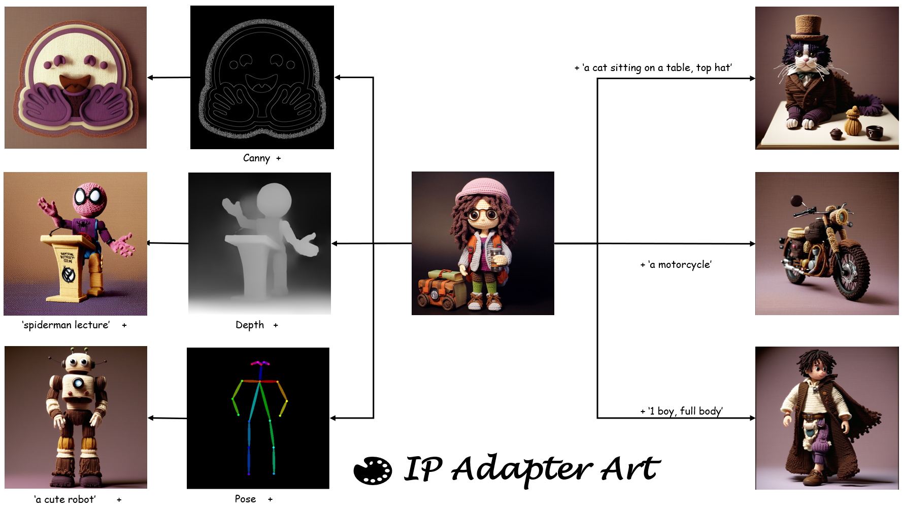

# IP Adapter Art：

<a href='https://huggingface.co/AisingioroHao0/IP-Adapter-Art'></a><a href=''></a> [](https://colab.research.google.com/drive/1kV7q3Gzr8GPG9cChdDQ5ncCx84TYjuu3?usp=sharing)



------

## Introduction

IP Adapter Art is a specialized version that uses a professional style encoder. Its goal is to achieve style control through reference images in the text-to-image diffusion model and solve the problems of instability and incomplete stylization of existing methods. This is a preprint version, and more models and training data coming soon.

## How to use

[](https://colab.research.google.com/drive/1kV7q3Gzr8GPG9cChdDQ5ncCx84TYjuu3?usp=sharing)  can be used to conduct experiments directly.

For local experiments, please refer to a [demo](https://github.com/aihao2000/IP-Adapter-Artist/blob/main/ip_adapter_art_sdxl_demo.ipynb).

Local experiments require a basic torch environment and dependencies:

```
pip install diffusers
pip install transformers
pip install git+https://github.com/openai/CLIP.git
pip install git+https://github.com/aihao2000/IP-Adapter-Art.git
```

## More Examples


## Citation

```
@misc{ipadapterart,
  author = {Hao Ai, Xiaosai Zhang},
  title = {IP Adapter Art},
  year = {2024},
  publisher = {GitHub},
  journal = {GitHub repository},
  howpublished = {\url{https://github.com/aihao2000/IP-Adapter-Art}}
}
```